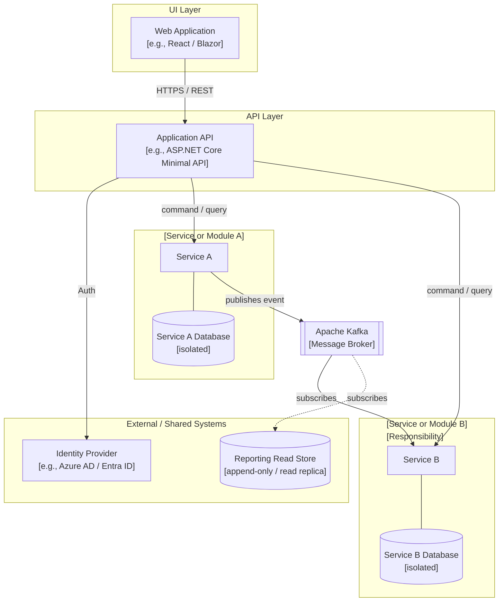

# Remediation Plan — [Application Name]

**Based on Architecture Review Dated:** [Review Date]  
**Plan Owner:** [Team Lead / Platform Lead]  
**Plan Created:** [Date]  
**Next Review Checkpoint:** [Date]

---

## Strategic Direction (North Star)

> _This section summarizes the strategic recommendation from the architecture review. It frames every remediation decision below — the horizon, sequencing, and approach of short and mid-term items should all be consistent with this direction. Read this section first._

**Strategic Recommendation:** [Refactor / Re-write / Re-Platform]

**Rationale:**  
[2–4 sentences explaining why this strategic direction was chosen over the alternatives. Reference the review's recommendation section.]

**Long-Term Desired State:**  
[Describe what the application looks like when the North Star is reached — technology stack, architecture posture, quality standards met, key problems eliminated.]

**Key Constraints & Dependencies:**

- [Budget, headcount, or business approval requirements]
- [Dependencies on other systems, teams, or infrastructure decisions]
- [Hard deadlines or external drivers (e.g., EOL support dates)]

---

### Future State Architecture Diagram

_High-level component diagram showing the major logical components of the desired future state and how they relate. Focus on what the system is made of and how the pieces connect — not how it is deployed or hosted._

_Update this diagram as architectural decisions are made. Use the Mermaid block below as a starting point and replace the placeholder components with the real ones for this application._

> **Diagram notes:**
>
> - Solid arrows = primary data or control flow
> - Dashed arrows = optional, async, or read-only interactions
> - Replace placeholder labels with the actual component names and technologies chosen for this application
> - Remove layers or components that do not apply; add any that are missing

---

## Short-Term Remediation (0–90 Days)

_Immediate, high-priority improvements the team can execute now. These address active risks or are high-value, low-effort wins that apply regardless of the strategic direction chosen above._

---

### ST-1: [Item Title]

| Field                | Detail                                 |
| -------------------- | -------------------------------------- |
| **Layer(s)**         | [e.g., Security / Data]                |
| **Severity**         | [High / Medium / Low]                  |
| **Estimated Effort** | [e.g., 1–2 days / 1 week]              |
| **Owner**            | [Person or team]                       |
| **Depends On**       | [None, or reference another item]      |
| **Status**           | [Not Started / In Progress / Complete] |

**Strategy:**  
[What will be done and specifically how. Be concrete — name the files, methods, or components being changed. Vague intent is not a strategy.]

**Reason:**  
[Why this item is prioritized now. What active risk, audit finding, or quality failure makes this urgent?]

**Value:**  
[The concrete outcome when this is complete — what risk is eliminated, what capability is gained, what cost or friction is reduced.]

---

### ST-2: [Item Title]

| Field                | Detail      |
| -------------------- | ----------- |
| **Layer(s)**         |             |
| **Severity**         |             |
| **Estimated Effort** |             |
| **Owner**            |             |
| **Depends On**       |             |
| **Status**           | Not Started |

**Strategy:**

**Reason:**

**Value:**

---

### ST-3: [Item Title]

| Field                | Detail      |
| -------------------- | ----------- |
| **Layer(s)**         |             |
| **Severity**         |             |
| **Estimated Effort** |             |
| **Owner**            |             |
| **Depends On**       |             |
| **Status**           | Not Started |

**Strategy:**

**Reason:**

**Value:**

---

_Add additional ST items as needed._

---

## Mid-Term Remediation (90 Days – 12 Months)

_Structural quality improvements that require more design, coordination, or effort. These reduce technical debt, improve maintainability and testability, and move the application toward the North Star. Short-term security and risk items must be complete or in-flight before mid-term structural work begins._

---

### MT-1: [Item Title]

| Field                | Detail                                           |
| -------------------- | ------------------------------------------------ |
| **Layer(s)**         | [e.g., Backend / Data]                           |
| **Severity**         | [High / Medium / Low]                            |
| **Estimated Effort** | [e.g., 2–4 weeks / 1 quarter]                    |
| **Owner**            | [Person or team]                                 |
| **Depends On**       | [e.g., ST-1 complete, or architectural decision] |
| **Status**           | Not Started                                      |

**Strategy:**  
[What will be done and how. For larger items, describe the approach and any key design decisions.]

**Reason:**  
[Why this item belongs in the mid-term bucket — what makes it important but not urgent? What structural problem does it address?]

**Value:**  
[The concrete improvement delivered — what becomes easier, safer, faster, or more reliable when this is done?]

---

### MT-2: [Item Title]

| Field                | Detail      |
| -------------------- | ----------- |
| **Layer(s)**         |             |
| **Severity**         |             |
| **Estimated Effort** |             |
| **Owner**            |             |
| **Depends On**       |             |
| **Status**           | Not Started |

**Strategy:**

**Reason:**

**Value:**

---

### MT-3: [Item Title]

| Field                | Detail      |
| -------------------- | ----------- |
| **Layer(s)**         |             |
| **Severity**         |             |
| **Estimated Effort** |             |
| **Owner**            |             |
| **Depends On**       |             |
| **Status**           | Not Started |

**Strategy:**

**Reason:**

**Value:**

---

_Add additional MT items as needed._

---

## Long-Term / North Star Work

_Significant investments aligned to the strategic recommendation. These require business consensus, executive sponsorship, or architectural design work before execution can begin. Attempting these without completing critical short-term work first is not recommended._

---

### LT-1: [Item Title]

| Field                | Detail                                                     |
| -------------------- | ---------------------------------------------------------- |
| **Layer(s)**         | [e.g., All Layers]                                         |
| **Estimated Effort** | [e.g., 6–18 months]                                        |
| **Owner**            | [Team + Executive Sponsor]                                 |
| **Depends On**       | [Key decisions, budget approval, prerequisite ST/MT items] |
| **Status**           | Not Started                                                |

**Strategy:**  
[High-level approach for this investment — what does execution look like, what are the major phases, what decisions must be made first?]

**Reason:**  
[Why this is the right long-term direction. What does in-place work fail to achieve that justifies this level of investment?]

**Value:**  
[The business and technical outcomes delivered when complete. Frame in terms of risk reduction, capability gained, and operational improvement.]

---

### LT-2: [Item Title]

| Field                | Detail      |
| -------------------- | ----------- |
| **Layer(s)**         |             |
| **Estimated Effort** |             |
| **Owner**            |             |
| **Depends On**       |             |
| **Status**           | Not Started |

**Strategy:**

**Reason:**

**Value:**

---

_Add additional LT items as needed._

---

## Summary Table

_Use this table for at-a-glance tracking. Keep it in sync with the detail sections above._

| ID   | Title | Horizon    | Severity | Est. Effort | Owner | Status      |
| ---- | ----- | ---------- | -------- | ----------- | ----- | ----------- |
| ST-1 |       | Short-Term |          |             |       | Not Started |
| ST-2 |       | Short-Term |          |             |       | Not Started |
| ST-3 |       | Short-Term |          |             |       | Not Started |
| MT-1 |       | Mid-Term   |          |             |       | Not Started |
| MT-2 |       | Mid-Term   |          |             |       | Not Started |
| MT-3 |       | Mid-Term   |          |             |       | Not Started |
| LT-1 |       | Long-Term  |          |             |       | Not Started |
| LT-2 |       | Long-Term  |          |             |       | Not Started |

---

## Decision Log

_Record key decisions made during remediation planning and execution. This preserves context for future reviewers and avoids relitigating resolved questions._

| Date | Decision | Rationale | Made By |
| ---- | -------- | --------- | ------- |
|      |          |           |         |
|      |          |           |         |
